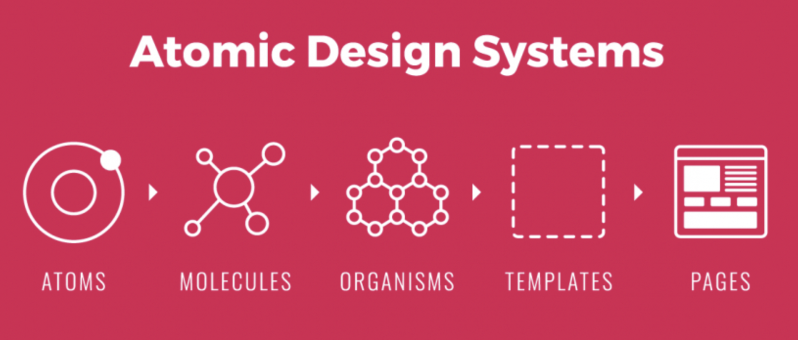
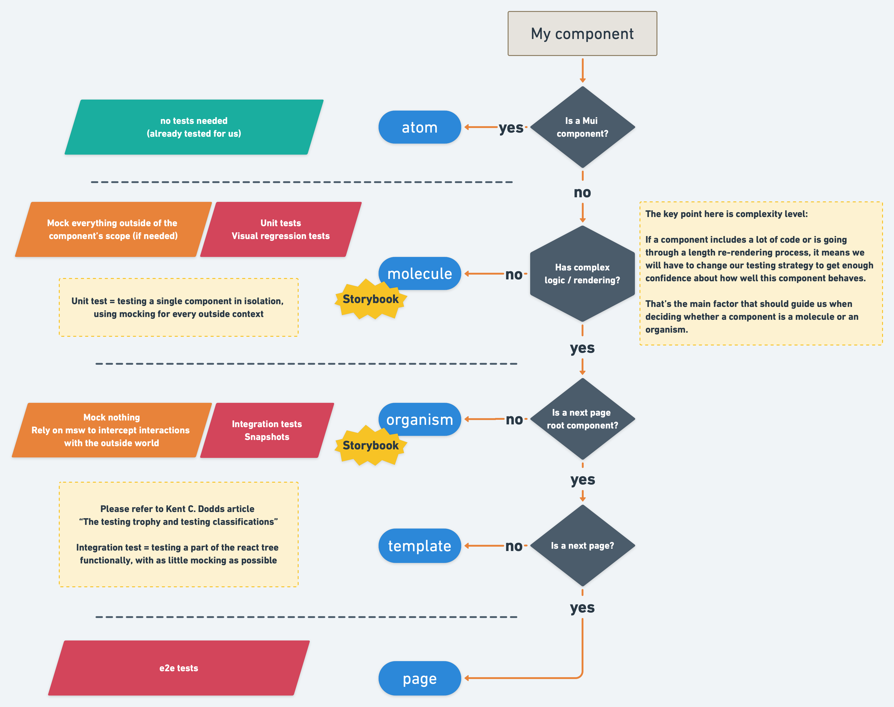
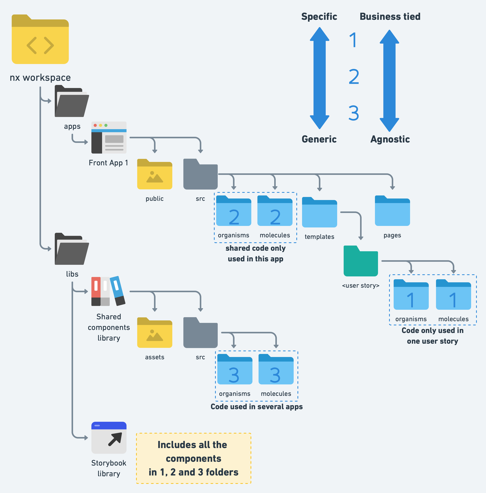

# ⚡ Frontend architecture

Our goal here is to classify components in order to know easily how we should test them: some components are simple and may only need a few unit tests to get the team confident about their robustessness. On the other hand, others may be quite complex, embedding interactions with the outside world, or complex logic for example.

Categorizing components can also help us defining what could be a milestone for us in the delivery of a user story.

We can use [atomic design](https://atomicdesign.bradfrost.com/chapter-2/) as a basis to classify our components.

But why even doing this in the first place, anyway? 🤔

## 🔶 Common language used in tech team and in product team

It's easier to work together if a common language is used by both the product team and the dev team, instead of having a purely technical way to define components on one side, and a product driven definition on the other side.

## 🔶 Removing ambiguity about testing

How should I test my component? Which rules should I follow when testing it? Why should I even choose that testing strategy instead on another?

We can make it easier for every developer in our team to answer these questions right away by binding a testing strategy to each type of component. This clarifies what is expected for a component as well, for code reviews.

## 🔶 Plan ahead

Classifying components will make it easier for us on the long run: we will be able to reason by scale and to use a divide & conquer approach when preparing a user story. This page contains two independent parts with complex rendering? Well, that means we will have two organisms then! That means we will write two integration tests!

## 🔶 Clarify the amount of job that needs to be done

It also can help us refine our estimations when we want to know how complex a user story is, by taking a look at the provided UI model. We can easily split it down in organisms, which themselves will be made with molecules, etc... Sizing the user story will be much easier by taking this approach.

## 🔶 Create milestones

Using storybook, we can easily demonstrate how well is advancing the user story, and validate distinct parts of the user story with product team.

# ⚡ Cool! But what does it mean concretely?

Let's reflect on the classification we want to use. Here is a proposal:

| Category  | Description                                                                                                                                                                                                          |
| --------- | -------------------------------------------------------------------------------------------------------------------------------------------------------------------------------------------------------------------- |
| Atoms     | Since we are using an UI library (Mui), we can consider components coming from this library to be **Atoms**. Somebody also is responsible for testing them, so no need to do that!                                   |
| Molecules | Simple components only do one thing. They have little to no logic on their own; they often are just presentational                                                                                                   |
| Organisms | Some compoents are bigger, embedding complex logic or having sophisticated rendering logic. This is often where something can go wrong in our app: several small blocks having to work together to come to a result. |
| Templates | We may want to create a 1-1 relationship between user stories and **Templates**. In that context, templates would be the root component of an entire page, made from several organisms                               |
| Pages     | Finally **Pages** would pretty much be nextjs pages...                                                                                                                                                               |

## 🔶 Defining a decision tree to classify components

With this in mind, we can now think about a decision tree to identify the type of every component. We will also take advantage of this to define a few things:

- What should and shouldn't be on storybook.
- Which testing strategy should be used for each category.

## 🔶 Onward to the intricacies of a multi-apps environment

Yes! We want to have several frontend applications. And we want to have shared components that we may reuse in our apps. `nx` will help us in that regard:

- We will be using several next apps and it may occur that we end up with components only being used in one app.
- Shared components can be defined in a library.
- We will need a library embedding storybook config, so that we only expose a single storybook for all our apps.

