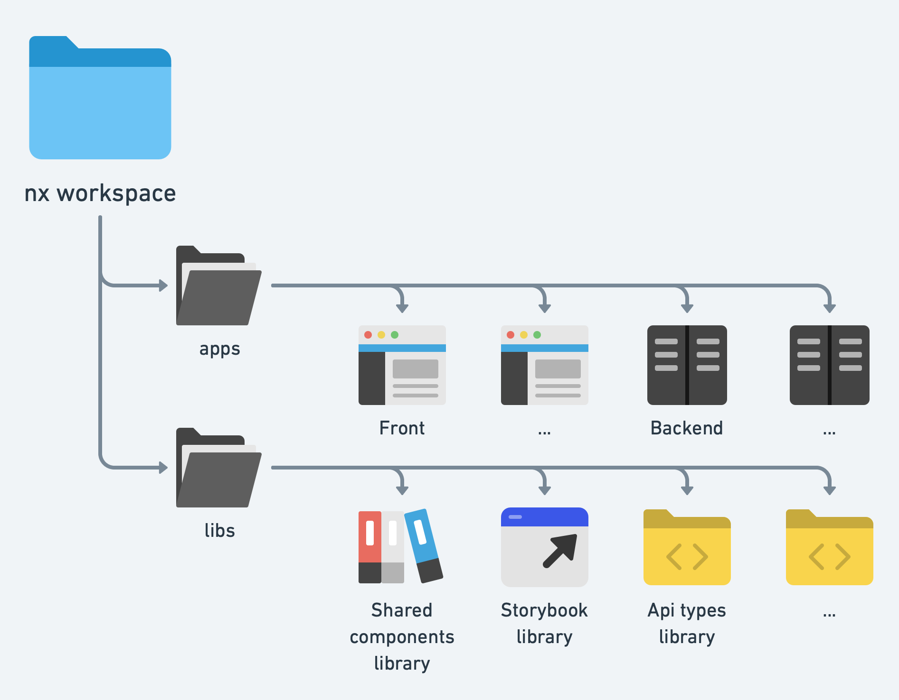

# ⚡ Monorepo paradygm and codebase structure

We will be using [Nx](https://nx.dev) to make sure we can use several frontend apps, and to share code between them. Nx also has a cloud service that does pretty cool stuffs, like caching runs results, allowing us to save a lot of time for parts of the codebase that had no changes.

## 🔶 nx magnets, how do they work?

So how does nx work? We first have to talk about applications and libraries.



### 🧿 Applications

In a nx workspace, the `apps` folder contains all the available applications. Applications can be easily bootstraped using generators. There is a lot of already available generators, like [`@nrwl/react`](https://nx.dev/react/overview), [`@nrwl/nest`](https://nx.dev/nest/overview), [`@nrwl/next`](https://nx.dev/next/overview), [`@nrwl/storybook`](https://nx.dev/storybook/overview-react) and so on.

So to create a next app, we would simply do the following:

```bash
nx g @nrwl/next:app my-new-app
```

In our example, we will have four apps:

| Application       | Description                                                                 | Framework / Dependencies                                                                                                                                                                                                                                             |
| ----------------- | --------------------------------------------------------------------------- | -------------------------------------------------------------------------------------------------------------------------------------------------------------------------------------------------------------------------------------------------------------------- |
| 🚀 Backend app    | Our main backend, exposing REST endpoints                                   | [nestjs](https://docs.nestjs.com), [swagger](https://swagger.io/docs/)                                                                                                                                                                                               |
| 🚀 Frontend app   | Our sample application containing a signup page and a logged user home page | [nextjs](https://nextjs.org/docs/getting-started), [react-query](https://tanstack.com/query/v4/docs/overview), [material-ui](https://mui.com/material-ui/getting-started/overview/), [testing library](https://testing-library.com/docs/react-testing-library/intro) |
| 🚀 Storybook app  | An app responsible for serving storybook build                              | [nextjs](https://nextjs.org/docs/getting-started), [storybook](https://storybook.js.org/docs/react/get-started/introduction)                                                                                                                                         |
| 🚀 End to end app | An app responsible for running end to end tests                             | [cypress](https://docs.cypress.io), [testing library](https://testing-library.com/docs/cypress-testing-library/intro)                                                                                                                                                |

### 🧿 Libraries

Libraries contain code that will be shared between several apps. They are defined in the `libs` folder. Then again, libraries can be bootstraped using generators, like [`@nrwl/node`](https://nx.dev/node/overview), for example.

In our example, we will be using a bunch of libs to be able to work with several frontend apps sharing common code:

| Library                 | Description                                                                         | Framework / Dependencies                                                                                                                                                                                                                                                         |
| ----------------------- | ----------------------------------------------------------------------------------- | -------------------------------------------------------------------------------------------------------------------------------------------------------------------------------------------------------------------------------------------------------------------------------- |
| 🧩 Api library          | Library containing react-query queries & mutations as well as their msw handlers    | [react-query](https://tanstack.com/query/v4/docs/overview), [axios](https://axios-http.com/docs/intro), [msw](https://mswjs.io/docs/)                                                                                                                                            |
| 🧩 Components library   | Design system components and components shared among several frontend apps          | [material-ui](https://mui.com/material-ui/getting-started/overview/), [storybook](https://storybook.js.org/docs/react/get-started/introduction), [jest](https://jestjs.io/docs/getting-started), [testing library](https://testing-library.com/docs/react-testing-library/intro) |
| 🧩 Contexts library     | Shared contexts (Snackbar, for example)                                             |                                                                                                                                                                                                                                                                                  |
| 🧩 Logic library        | Shared logic files                                                                  |                                                                                                                                                                                                                                                                                  |
| 🧩 Storybook library    | Building storybook and serving it in watch mode                                     | [storybook](https://storybook.js.org/docs/react/get-started/introduction), [msw](https://mswjs.io/docs/)                                                                                                                                                                         |
| 🧩 Tests library        | Tests related wrappers and helpers used in frontend apps and the components library | [jest](https://jestjs.io/docs/getting-started), [testing library](https://testing-library.com/docs/react-testing-library/intro)                                                                                                                                                  |
| 🧩 Theme library        | Application theme                                                                   | [material-ui](https://mui.com/material-ui/getting-started/overview/)                                                                                                                                                                                                             |
| 🧩 Translations library | Translations locales and helpers                                                    | [i18next](https://www.i18next.com)                                                                                                                                                                                                                                               |

## 🔶 nx configuration

Regarding nx, we have two levels of configuration. One at root level and one for each app/lib.

### 🧿 `workspace.json`

The `workspace.json` file is defined at root level and keeps track of the available apps and libs. It contains a path by item:

```json
{
  // ...
  "projects": {
    "frontend-app": "apps/front",
    "backend-app": "apps/back",
    "front-storybook-app": "apps/storybook",
    "front-api-lib": "libs/front/api",
    "front-components-lib": "libs/front/components",
    "front-logic-lib": "libs/front/logic",
    "front-storybook-lib": "libs/front/storybook",
    "front-translations-lib": "libs/front/translations"
    // ...
  }
}
```

### 🧿 `project.json`

Each app/lib contains a `project.json` file that defines the available commands for this item.
Let's take as an example the `project.json` file of our [frontend app](./../apps/front/project.json) and review a few tasks there:

#### 🎁 Running commands

We can run arbitrary commands using the `nx:run-commands` executor. that one copies locales in the app public folder, so that they can be used by i18next.

```json
{
  [...]
  "targets": {
    [...]
    "copy-locales": {
      "executor": "nx:run-commands",
      "options": {
        "command": "echo Copying locales... && cp -R ./libs/front/translations/assets/locales ./apps/front/public/"
      }
    },
    [...]
  }
```

#### 🎁 `build`

This task uses the build exectutor of `@nrwl/next` to build our nextjs app. Note the use of the `assets` property, allowing us to add content to the `public` folder of the next app.

```json
{
  [...]
  "targets": {
    [...]
    "build": {
      "executor": "@nrwl/next:build",
      "outputs": ["{options.outputPath}"],
      "defaultConfiguration": "production",
      "options": {
        "root": "apps/front",
        "outputPath": "dist/apps/front",
        "assets": [
          {
            "input": "apps/front/public",
            "glob": "**/*",
            "output": "."
          },
          {
            "input": "libs/front/translations/assets",
            "glob": "**/*",
            "output": "."
          },
          {
            "input": "libs/front/components/assets",
            "glob": "**/*",
            "output": "."
          }
        ]
      },
    [...]
  }
```

#### 🎁 `serve`

This task uses the server exector of `@nrwl/next` to launch the nextjs app.

```json
{
  [...]
  "targets": {
    [...]
    "serve": {
      "executor": "@nrwl/next:server",
      "options": {
        "buildTarget": "frontend-app:build",
        "dev": true,
        "port": 3000
      },
      "configurations": {
        "production": {
          "buildTarget": "frontend-app:build:production",
          "dev": false
        },
        "development": {
          "buildTarget": "frontend-app:build:development",
          "dev": true
        }
      },
      "defaultConfiguration": "development"
    },
    [...]
  }
```

#### 🎁 `test`

That one uses the jest executor of `@nrwl/jest` to run jest, using the config file passed in the options prop.

```json
{
  [...]
  "targets": {
    [...]
    "test": {
      "executor": "@nrwl/jest:jest",
      "outputs": ["{workspaceRoot}/coverage/apps/front"],
      "options": {
        "jestConfig": "apps/front/jest.config.ts",
        "passWithNoTests": true
      }
    },
    [...]
  }
```

#### 🎁 `lint`

That one uses the eslint executor of `@nrwl/linter` to run eslint, using the path passed in the options prop.

```json
{
  [...]
  "targets": {
    [...]
    "lint": {
      "executor": "@nrwl/linter:eslint",
      "outputs": ["{options.outputFile}"],
      "options": {
        "lintFilePatterns": ["apps/front/**/*.{ts,tsx,js,jsx}"]
      }
    },
    [...]
  }
```

#### 🎁 `type-check`

Finally, we want to run typescript to validate the types. We can do this using `nx:run-commands`:

```json
{
  [...]
  "targets": {
    [...]
    "type-check": {
      "executor": "nx:run-commands",
      "options": {
        "command": "pnpm exec tsc -p ./apps/front/tsconfig.json --noEmit --pretty"
      }
    },
    [...]
  }
}
```

## 🔶 CLI

nx comes with [its own CLI](https://nx.dev/l/n/getting-started/nx-cli). Here is a short list of commands that may be handy:

### 🧿 miscellaneous

| Description           | Command                  |
| --------------------- | ------------------------ |
| 🆘 Get help!!!        | `pnpm exec nx help`      |
| 📊 Dependencies graph | `pnpm exec nx dep-graph` |

### 🧿 Running actions

| Description                                          | Command                                                                    |
| ---------------------------------------------------- | -------------------------------------------------------------------------- |
| ▶️ Run an action on one project                      | `pnpm exec nx run <project>:<action>`                                      |
| ▶️ Run an action on all projects                     | `pnpm exec nx run-many --target=<action> --all`                            |
| ▶️ Run an action on a set of projects                | `pnpm exec nx run-many --target=<action> --projects=<project1>,<project2>` |
| ▶️ Run an action only on projects containing changes | `pnpm exec nx affected:<action>`                                           |

#### 🎁 Typical actions

Actions are defined by project in `project.json` files. Here are a few standard actions:

| Action        | Description                                                  |
| ------------- | ------------------------------------------------------------ |
| 🛠️ build      | Builds the app/lib. Use `--prod` flag for a production build |
| 🚀 serve      | Runs the app                                                 |
| ⚠️ lint       | Run the linter against project files                         |
| ✔️ type-check | Uses `tsc --noEmit` to validate types against project files  |
| ✅ test       | Runs tests                                                   |
| ☑️ e2e        | Runs end to end tests                                        |

#### 🎁 Useful flags

| flag                 | Description                                                    |
| -------------------- | -------------------------------------------------------------- |
| ⬛ `--target=x`      | specifies which action to run                                  |
| ⬛ `--skip-nx-cache` | disables nx caching; the command will be ran fully             |
| ⬛ `--verbose`       | prints additional error stack trace on failure                 |
| ⬛ `--projects=x,x`  | `run-many`: specifies which projects to run the action against |
| ⬛ `--parallel=x`    | `run-many`: allows x tasks to be ran in parallel               |

### 🧿 Running tests

| Description                               | Command                                                                          |
| ----------------------------------------- | -------------------------------------------------------------------------------- |
| ✅ Run tests for a project (watch)        | `pnpm test-changes <project>` or `pnpm exec nx test --project=<project> --watch` |
| ✅ Run all tests for a project (watchAll) | `pnpm test-dev <project>` or `pnpm exec nx test --project=<project> --watchAll`  |
| ✅ Run all tests                          | `pnpm test-all` or `pnpm exec nx run-many --target=test --parallel --all`        |

### 🧿 Creating applications or libraries

| Description                        | Command                                                                                  |
| ---------------------------------- | ---------------------------------------------------------------------------------------- |
| 🗃️ Create a new front app or lib   | `pnpm exec nx g @nrwl/react:app <appname>` or `pnpm exec nx g @nrwl/react:lib <appname>` |
| 🗃️ Create a new backend app or lib | `pnpm exec nx g @nrwl/nest:app <appname>` or `pnpm exec nx g @nrwl/nest:lib <appname>`   |
| 🗃️ Create a vanilla node lib       | `pnpm exec nx g @nrwl/node:lib <libname>`                                                |
