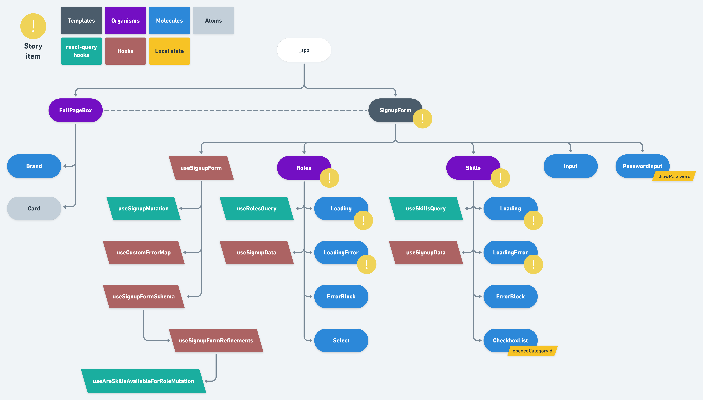

# ⚡ Storybook

## 🔶 Why using storybook?

Storybook is a great tool. We can use it to help both developers and our product team.

### 🧿 Better visibility on existing features

It's easier for the dev team to find out if a component already exists and if it fits the new use case we need to implement. Developers can also better understand how a component is meant to be used and if edge cases are taken into account.

### 🧿 Giving visibility to the product team

We can use storybook to demonstrate each part of our work to the product team. The idea is to break down user stories in milestones that can be independently validated.

Let's take an example:
I was given a signup feature to deliver. We have a few questions to address during the conception phase:

#### 🔻 Interactions with our backend(s)

> Which endpoints will be called and what will be their input and output?

#### 🔻 Components tree

> Following the [atomic design](./frontend-architecture.md) architecture, what kind of components tree do we need?
>
> ❇️ Will we use contexts? Why?
>
> ❇️ Will we use atomic state (jotai)?
>
> ❇️ Will we use some generic components or shared hooks, and if so which ones?
>
> ❇️ Will we need local state? At which level of the tree?
>
> ❇️ What will be the level of genericity or specialization of each component or hook?
>
> > Generic being used in several apps, specialized being used only in that story.

#### 🔻 Technical debt

> ❇️ Are we sure everything is at the right level? Should we refactor existing code to limit specialization ?
>
> > The more specialized code we add, the bigger our codebase becomes. This is usually not desirable because it means our maintenance perimenter is increased. There is cases when factorization is actually a **bad move** however. For example when we are talking about functionally distinct things that will have unrelated maintenance agendas.
>
> ❇️ Is what we just designed easy to understand and to alter?
>
> > `A plan that cannot be changed is a bad one.` and all that sort of things.

etc, etc.

But let's focus on the component tree for now. Doing it allows us to easily define our delivery milestones:



In our example, and following [this plan](./frontend-architecture.md), we can demonstrate one template (the final delivery), two organisms and two molecules (milestones).

These are the specialized elements for our story while others are generic items that may already exist in our codebase. Of course, if we have to create a generic component, we would have to add it to storybook and get it validated as well then!

## 🔶 Storybook categories

The point is to have only one storybook for all our ecosystem, that may be made of several apps. That storybook will also contain generic components defined in libraries.

We can follow the following diagram to organize stories within storybook:


## 🔶 Setting up storybook

### 🧿 Creating a library

The first step is to create a library with the `@nrwl/node` plugin:

```bash
pnpm nx g @nrwl/node:lib storybook
```

### 🧿 Configuring storybook

The next step is to configure storybook. Storybook configuration is typically defined in a `.storybook` folder at repo root level. In a nx monorepo we generally both have a `.storybook` folder at root level and one inside each frontend app. In our case, since we want to ony have one storybook deployed, we will hold the storybook config in a dedicated library.

#### Tweaking storybook config

The main part of the configuration is defined in the `main.js` file. Our goal here is to include the stories of all our apps and our libs. We also need to include static files defined in the `public` folder of next apps and in the `assets` of our libs.

```js
// Pulling root storybook config
const rootMain = require('../../../../.storybook/main');

/** @type {import("@storybook/react/types/index").StorybookConfig} */
const storybookMainConfig = {
  ...rootMain,

  core: { ...rootMain.core, builder: 'webpack5' },

  // We will include the stories defined in all the apps and all the libs
  stories: [
    ...rootMain.stories,
    '../../../../**/*.stories.mdx',
    '../../../../**/*.stories.tsx',
  ],
  // Including assets
  staticDirs: [
    '../../../../apps/front/public',
    '../../../../libs/front/components/assets',
  ],
  addons: [...rootMain.addons, '@nrwl/react/plugins/storybook'],
  webpackFinal: async (config, { configType }) => {
    // apply any global webpack configs that might have been specified in .storybook/main.js
    if (rootMain.webpackFinal) {
      config = await rootMain.webpackFinal(config, { configType });
    }

    /**
     * Fixes issue with `next-i18next` and is ready for webpack@5
     * @see https://github.com/isaachinman/next-i18next/issues/1012#issuecomment-792697008
     * @see https://github.com/storybookjs/storybook/issues/4082#issuecomment-758272734
     * @see https://webpack.js.org/migrate/5/
     */
    config.resolve.fallback = {
      fs: false,
      http: false,
      https: false,
      timers: false,
      stream: false,
      zlib: false,
      path: false, //require.resolve('path-browserify'),
    };

    return config;
  },
  features: { emotionAlias: false },
  env: (config) => ({
    ...config,
    NEXT_PUBLIC_API_URL: 'https://rhf-mui-nx-sandbox-api.com',
  }),
};

module.exports = storybookMainConfig;
```

#### 🎁 Translations

See [`Multi languages support`](./translations.md).

#### 🎁 Msw

We will use msw to intercept XHR calls and give them the result we want to meet the demonstration purpose of each story. To do so we need to do a few things.

**Sharing handlers between integration tests and storybook**

We have to take into account a small difference. In integration tests we have to apply handlers to the server while in storybook we do not, since we are using `msw-storybook-addon`. So we will create an helper function that will conditionally apply `server.use` on the passed handler:

```typescript
export const genericGetHandler = ({
  backend,
  path,
  status,
  result,
  applyToServer = true,
}: GenericHandlerParams) => {
  const url = getUrl(backend, path);

  // Defining the handler and applying result to it
  const handler = rest.get(url, (_, res, ctx) =>
    res(ctx.status(status), ctx.json(result))
  );

  return applyHandlerToServer(handler, applyToServer);
};

const applyHandlerToServer = (
  handler: RestHandler<MockedRequest<DefaultBodyType>>,
  useServer: boolean
) => {
  // Conditionally calling server.use
  if (useServer) {
    const { mswServer } = require('./../mswServer');
    return mswServer.use(handler);
  }

  return handler;
};
```

Now we can easily define our handlers:

```typescript
// Our handler for the role query
export const rolesQuery = (
  status: number,
  result: DefaultBodyType,
  applyToServer = true
) =>
  genericGetHandler({
    backend: 'backend-app',
    path,
    status,
    result: { result },
    applyToServer,
  });
```

**Configuring storybook**

Let's tweak `preview.js` file by adding the msw decorator:

```javascript
import { initialize, mswDecorator } from 'msw-storybook-addon';

// Initialize MSW
initialize({
  onUnhandledRequest: 'bypass',
  serviceWorker: {
    url: `./../mockServiceWorker.js`,
    options: { scope: '/' },
  },
});

export const parameters = {
  // ...
  msw: {
    // We could define default handlers here
    handlers: {},
  },
};

export const decorators = [
  mswDecorator,
  // ...
];
```

**Using msw in storybook**

Now, let's intercept XHR calls in stories:

```typescript
export default {
  component: Signup,
  title: 'Front app/User stories/Signup/Templates/SignupForm',
  decorators: reactQueryDecorator,
} as ComponentMeta<typeof Signup>;

const MominalCaseTemplate: Story = (_) => {
  return <Signup />;
};

export const NominalCase = MominalCaseTemplate.bind({});
NominalCase.parameters = {
  msw: {
    handlers: {
      // setting third parameters to false to NOT apply the handler to server
      roles: msw.rolesQuery(200, mockedRoles, false),
      skills: msw.skillsQuery(200, mockedSkills, false),
      signup: msw.signupMutation(200, mockedUser, false),
      areSkillsAvailableForRole: msw.areSkillsAvailableForRoleMutation(
        200,
        [],
        false
      ),
    },
  },
};
```

### 🧿 Defining library tasks

Finally, let's define the tasks that can be executed for our library. We want to be able to build storybook and launch it in dev mode. We can use `@nrwl/storybook` for this:

project.json

```json
{
  // ...
  "projectType": "library",
  "targets": {
    "build": {
      "executor": "@nrwl/storybook:build",
      "outputs": ["{options.outputPath}"],
      "options": {
        "uiFramework": "@storybook/react",
        "outputPath": "dist/apps/storybook/public/storybook",
        "config": {
          "configFolder": "libs/front/storybook/.storybook"
        }
      },
      "configurations": {
        "ci": {
          "quiet": true
        }
      }
    }
  }
}
```

## 🔶 Running storybook

We can use the next app to run storybook. The `build` and `serve` commands will call `front-storybook-lib:build` under the hood.

```bash
// Launching storybook in watch mode (dev)
pnpm nx run front-storybook-app:serve

// Building storybook
pnpm nx run front-storybook-app:build
```
