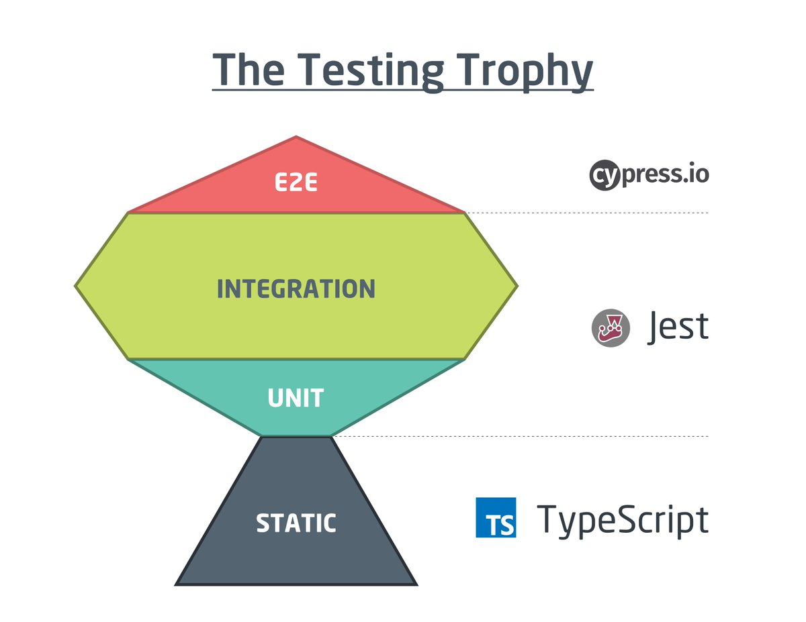

# ⚡ Testing

Let's talk a bit about the various types of tests we can do and what problems they do solve.

What we aim to do is trophy testing, basing ourself on [Typescript](https://www.typescriptlang.org), [jest](https://jestjs.io), [testing library](https://testing-library.com), [msw](https://mswjs.io) and [cypress](https://www.cypress.io).

## 🔶 Providing testing helpers

### 🧿 Defining providers

The first step is to define the providers that will be used in our custom appRender functions.

A provider typically looks like this:

```typescript
type TestWrapper = ({ children }: PropsWithChildren<unknown>) => JSX.Element;

const ThemeProvider = (): TestWrapper => {
  const Wrapper = ({ children }: PropsWithChildren<unknown>) => (
    <MuiThemeProvider theme={appTheme}>{children}</MuiThemeProvider>
  );

  return Wrapper;
};
```

Then we need to create logic to combine an arbitrary number of wrappers:

```typescript
const wrappersToWrapper = (wrappers: Wrapper[]): Wrapper =>
  wrappers
    .slice()
    .reverse()
    .reduce(
      (Acc, Wrapper) =>
        ({ children }: PropsWithChildren<unknown>) =>
          (
            <Wrapper>
              <Acc>{children}</Acc>
            </Wrapper>
          ),
      ({ children }) => <>{children}</>
    );
```

Then we can create an `applyWrappers` function taking an Array of union strings as input:

```typescript
type RenderProviders = 'reactQuery' | 'form' | 'snackbar';

type ApplyWrappersProps<TForm> = {
  providers?: Array<RenderProviders>;
  formProviderWrapperDefaultValues?:
    | UnpackNestedValue<DeepPartial<TForm>>
    | undefined;
  i18nConfig?: I18nProviderProps;
};

const applyWrappers = <TForm>(props?: ApplyWrappersProps<TForm>) => {
  const defaultProviders = ['emotionCache', 'theme', 'i18n'];
  const providers = props?.providers || [];
  const wrappers = [...defaultProviders, ...providers].map((key) => {
    switch (key) {
      case 'theme': {
        return ThemeProvider();
      }
      case 'i18n': {
        return I18nProvider(props?.i18nConfig);
      }
      case 'snackbar': {
        return SnackbarProvider();
      }
      case 'reactQuery': {
        return ReactQueryProvider();
      }
      case 'form': {
        return FormProvider<TForm>(
          props?.formProviderWrapperDefaultValues as UnpackNestedValue<
            DeepPartial<TForm>
          >
        );
      }
      case 'emotionCache': {
        return EmotionCacheProvider();
      }
      default:
        throw new Error(`${key} no handled in applyWrappers`);
    }
  });

  return wrappersToWrapper(wrappers);
};
```

### 🧿 appRender functions

Finally, let's create our custom appRender functions. Since `@testing-library/user-event@14.0.0` we have to call the `userEvent` `setup` function. Let's wrap the user prop in the returned object:

```typescript
interface AppRenderResult extends RenderResult {
  user: UserEvent;
}

const appRender = <TForm>(
  ui: ReactElement,
  options?: ApplyWrappersProps<TForm>
): AppRenderResult => {
  const wrapper = applyWrappers(options);

  const withUser = {
    user: userEvent.setup(),
    ...render(ui, {
      wrapper,
    }),
  };

  return withUser;
};
```

```typescript
const appRenderHook = <TForm, TProps, TResult>(
  callback: (props: TProps) => TResult,
  options?: ApplyWrappersProps<TForm>
): RenderHookResult<TResult, TProps> => {
  const wrapper = applyWrappers(options);

  return renderHook(callback, {
    wrapper,
  });
};
```

### 🧿 Testing

This makes our test files pretty simple:

```typescript
describe('Logged user home component', () => {
  const appRender = () =>
    appRender(<LoggedUserHome />, { providers: ['reactQuery', 'form'] });

  it('should match snapshot when loading', () => {
    appRender();

    // [...]
  });
});
```

## 🔶 Testing strategy



### 🧿 Unit tests

They focus on testing a module - could be a component or a function - in isolation. That means any outside context this module may rely upon will be mocked. This are pretty straightforward tests, which are typically really fast.

You can find unit tests in the [molecules or organisms folder of the shared components library](./../libs/front/components/src/molecules). Here is a simple example:

```typescript
describe('Brand component', () => {
  it('should display brand informations', () => {
    appRender(<Brand color="white" />);

    expect(screen.getByText('Sandbox')).toBeInTheDocument();
    expect(
      screen.getByText('nextjs / react-hook-form / testing-library')
    ).toBeInTheDocument();
  });
});
```

### 🧿 Visual regression tests

These tests check that the small bricks of our app didn't drastically change visually. This is pretty useful when we defined our own system design relying on a whole set of generic components.

### 🧿 Snapshots

Snapshots are useful to make sure we didn't visually break another part of the application by touching a generic component for example.

You can find snapshot tests in the templates folder of the front app:

- [Logged user home](./../apps/front/src/templates/logged-user-home/LoggedUserHome.spec.tsx).
- [Signup form](./../apps/front/src/templates/signup-form/SignupForm.spec.tsx).

```typescript
describe('snapshots', () => {
  it('should match snapshot when loading', () => {
    msw.userDataQuery(200, undefined);

    const { baseElement } = appRender(<LoggedUserHome />);

    expect(baseElement).toMatchSnapshot();
  });

  it('should match snapshot when displaying user data', async () => {
    msw.userDataQuery(200, mockedUser);

    const { baseElement } = appRender(<LoggedUserHome />);

    await waitForElementToBeRemoved(() => screen.queryByRole('progressbar'));

    expect(baseElement).toMatchSnapshot();
  });
});
```

### 🧿 Integration tests

Integration tests have the highest return on investment because they are not as hard to write and maintain as e2e tests while giving us good confidence about a part of our system.

You can find integration tests in the templates folder:

- [Logged user home](./../apps/front/src/templates/logged-user-home/LoggedUserHome.spec.tsx).
- [Signup form](./../apps/front/src/templates/signup-form/SignupForm.spec.tsx).

```typescript
it('should display user data', async () => {
  msw.userDataQuery(200, mockedUser);

  appRender(<LoggedUserHome />);

  await waitForElementToBeRemoved(() => screen.queryByRole('progressbar'));

  const { firstName, lastName, userName } = mockedUser;

  expect(screen.getByText(`${firstName} ${lastName}`)).toBeInTheDocument();
  expect(screen.getByText(`${userName}`)).toBeInTheDocument();
});
```

### 🧿 End to end testing

The tests giving us the most confidence. They also cost a lot. So it's generally wiser to only write e2e for key features of our application; the ones that represent a critical risk for the product.
