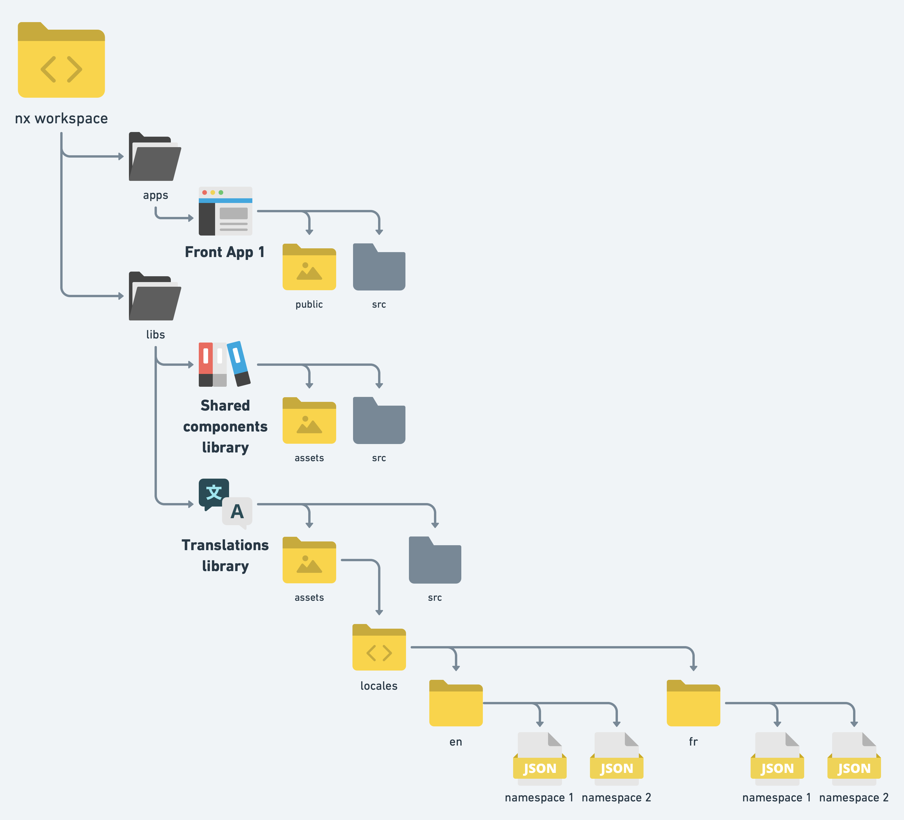
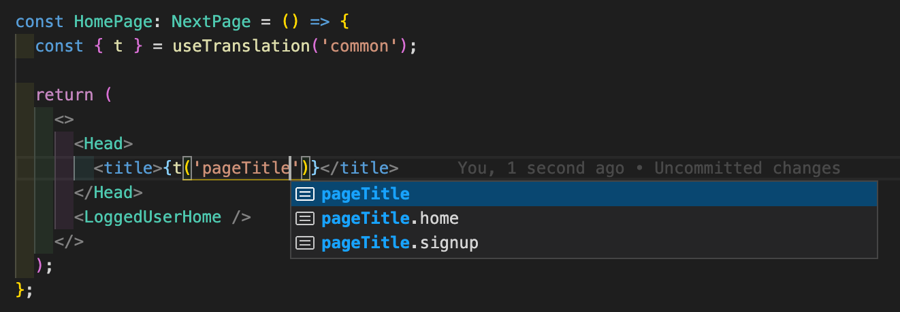
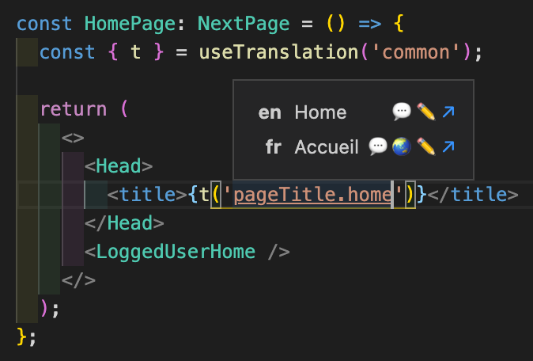
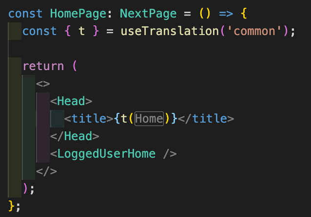

# ⚡ Multi languages support

We will use [next-i18next](https://github.com/isaachinman/next-i18next) for this task. The library is built on top of [react-i18next](https://react.i18next.com) which is the most used tool for internationalization in the react ecosystem.

Let's see together how it rolls!

## 🔶 Defining / fetching translations

Firstof let's create a library using `@nrwl/node:lib`. The purpose of our new library will be to hold (and possibly fetch) the json files containing our translations.

Translations will be held in json files containing nested json:

```json
{
  "pageTitle": {
    "signup": "Signup",
    "home":"Home"
  },
  "welcomeText": "Welcome!",
  [...]
}
```

We will call them namespaces. A nextjs page can use one or several namespaces, which essentially means the content of the associated json files will be injected in the bundle sent when getting this page. More about this later.

Let's focus on architecture. Our library will then contain an `assets` folder that will store our translations as an arbitrary number of json files (the namespaces).



Why putting them in a lib? Because these files will be used by several applications.

### 🧿 Fetching translations

On this POC, translations are defined directly in the json files. However, we may need to get these translations from an external source. To do so, we can easily define a task in the library `project.json` file:

```json
{
  [...]
  "targets": {
    "fetch-translations": {
      "executor": "@nrwl/workspace:run-commands",
      "options": {
        "command": "pnpm fetchTranslations"
      }
    },
    [...]
  },
  [...]
}
```

Here `fetchTranslations` is a npm script defined in `package.json` that will essentially execute the code defined in a typescript file. Note that we could also use ts-node here to directly execute typescript code.

The typescript file could then do something as simple as using fetch to retrieve translations and writing them in the library `./assets/locales` folder.

## 🔶 Integrating our translations in our front apps

Since we are using next, the namespaces must be copied in the `public` folder of each app before building the application. To do so, we will define a task in the `project.json` of each application:

```json
{
  [...]
  "targets": {
    "copy-locales": {
      "executor": "@nrwl/workspace:run-commands",
      "options": {
        "command": "echo Copying locales... && cp -R ./libs/front/translations/assets/locales ./apps/front/public/"
      }
    },
    [...]
  }
  [...]
}
```

Now we need to make sure this task is ran before building the app or launching it in dev mode. To do so, we can use the `dependsOn` property for this. Here is an example with the serve step:

```json
{
  [...]
  "targets": {
    "serve": {
      "executor": "@nrwl/next:server",
      "options": {
        "buildTarget": "front:build",
        "dev": true,
        "port": 3000
      },
      "dependsOn": [
        {
          "target": "copy-locales",
          "projects": "self"
        }
      ],
      "configurations": {
        "production": {
          "buildTarget": "front:build:production",
          "dev": false
        }
      }
    },
    [...]
  }
  [...]
}
```

## 🔶 Configuring translations for a frontend

Firstof, we have to define a `next-i18next.config.js` file at application root:

```javascript
const path = require('path');

module.exports = {
  i18n: {
    defaultLocale: 'en',
    locales: ['en', 'fr'],
  },
  // Here we must specify the path of our namespaces, that will be copied in the public folder.
  localePath: path.resolve(`apps/front/public/locales`),
};
```

## 🔶 Loading namespaces in pages

Namespaces are loaded by page using either `getStaticProps` (SSG) or `getServerSideProps` (SSR). We want to only inject the namespaces that we really need for each page to limit the impact on performances.

In the following example, we are loading the `common` and `home` namespaces.

```typescript
import { serverSideTranslations } from 'next-i18next/serverSideTranslations';

const Home: NextPage = () => <HomeRoot />;

export const getStaticProps: GetStaticProps = async ({
  locale,
}: GetStaticPropsContext) => {
  return {
    props: {
      ...(await serverSideTranslations(locale || 'en', ['common', 'home'])),
    },
  };
};

export default Home;
```

## 🔶 Using translations in our components

### 🧿 Using only one namespace

If the component is only using translations defined in a single namespace, we can directly pass that namespace to the `useTranslation` function. Here we are loading the `errors` namespace, that contains in this example:

```json
{
  "genericError": {
    "title": "Oh no!",
    "message": "An unknown error occured"
  }
}
```

We use `t` function coming from the `useTranslation` hook:

```tsx
import { useTranslation } from 'next-i18next';

export const GenericError = () => {
  const { t } = useTranslation('errors');

  return (
    <FullpageError title={t('genericError.title')}>
      {t('genericError.message')}
    </FullpageError>
  );
};
```

### 🧿 Using several namespaces

Sometimes, we have to use translations coming from several namespaces within a component. We can do so by passing an array to the `useTranslation` function.

But it means we will have to preprend our keys with the namespace (`<namespace>:<key>`):

```tsx
import { useTranslation } from 'next-i18next';

export const HomePageError = () => {
  const { t } = useTranslation(['errors', 'home']);

  return (
    <FullpageError title={t('common:generic.pageTitle')}>
      {t('errors:genericError.message')}
    </FullpageError>
  );
};
```

Of course, for this to work, the page using this component must load both `common` and `error` namespaces via `getStaticProps` or `getServerSideProps`.

### 🧿 String interpolation

We may need to inject dynamic values in our translations. This can be done by using the second parameter of our `t` function:

```tsx
export const HomePage = ({ user: { firstname, lastname } }: HomePageProps) => {
  const { t } = useTranslation('home');

  t('welcomeBanner', {
    date: new Date(),
    userName: `${firstName} ${lastName}`,
  });
};
```

In the `home.json` namespace file, that key would look like this:

```json
{
  "welcomeBanner": "Welcome {{userName}}! Today date is {{date}}"
}
```

### 🧿 Translation keys and intellisense

react-i18next has a [nice little trick](https://react.i18next.com/latest/typescript) to infer namespaces and their assorted keys, allowing auto completion for these types. Cool!

Since we will be using translations in several applications and in at least one library (shared components), let's define the declaration file in our translation library:

`react-i18next.d.ts`:

```typescript
import 'react-i18next';

import common from './assets/locales/en/common.json';
import forms from './assets/locales/en/forms.json';

declare module 'react-i18next' {
  interface CustomTypeOptions {
    defaultNS: 'common';
    resources: {
      common: typeof common;
      forms: typeof forms;
    };
  }
}
```

Then all we have to do is to include the declaration file in the application or library that needs this definition:

`tsconfig.base.json`:

```json
{
  "extends": "../../tsconfig.base.json",
  [...],
  "include": [
    [...],
    "./../../libs/front/translations/react-i18next.d.ts"
  ]
}
```

And voilà!

### 🚨 Warning

Type inference is not perfect. See the first choice here?



Well what you will pass here is actually an object if we look at the json file:

```json
{
  "pageTitle": {
    "signup": "Signup",
    "home": "Home"
  }
}
```

Keep this in mind. You should always pass keys to the t function, not a nested object.

### 🧿 Helpers

Lokalise is maintaining a cool [vscode plugin](https://github.com/lokalise/i18n-ally) allowing us to check easily the values of our keys:



You can use the [webstorm plugin](https://plugins.jetbrains.com/plugin/17212-i18n-ally) instead if you're using that IDE.

The plugin will automatically display translated strings:



## 🔶 Translations and tests

The objective here is to do assertions on translations keys instead of using translated components in our tests. This makes our tests more robust since translations may change while keys rarely evolve.
We have two ways to handle testing. The first one is the most robust and it's the one we will be using.

### 🧿 Pass an i18n context to the render function

A way to solve the problem is to not mock `next-i18next` / `react-i18next` at all. What we will do instead is customizing the `render` function to inject an i18n instance to the components tree :

```typescript
import { render as rtlRender, RenderResult } from '@testing-library/react';
import i18n from 'i18next';
import { I18nextProvider, initReactI18next } from 'react-i18next';

i18n.use(initReactI18next).init({
  lng: 'en',
  fallbackLng: 'en',
  ns: ['common'],
  defaultNS: 'common',
  interpolation: {
    escapeValue: false,
  },
  appendNamespaceToMissingKey: true,
  missingKeyNoValueFallbackToKey: true,
  resources: { en: {} },
});

export const appRender = (component: JSX.Element): RenderResult => {
  const wrapper = ({ children }: PropsWithChildren<unknown>) =>
    <I18nextProvider i18n={i18n}>{children}</I18nextProvider>
  };

  return rtlRender(component, { wrapper });
};
```

Then all we have to is to use this custom render function. Since we inject no bundles, keys will be returned by the `t` function. This gives us the opportunities to do assertions on keys:

```typescript
describe('MyComponent', () => {
  it('should display a welcome message', () => {
    appRender(<FullpageBox>{children}</FullpageBox>);

    expect(screen.getByText(/common:welcome/i)).toBeInTheDocument();
  });
});
```

This method is arguably better for integration tests:

- We don't mock anything, so our tests are more robust (everytime you mock something, you lose confidence since a part of your system is bypassed).
- Tests are simpler since we don't have to mock `next-i18next`
- Perfs are better
- We don't have to care about the hooks call order in our components: with a `useTranslation` mock, the last call will override the previous mock implementations, so namespace may vary.

#### 📣 `Making in depth assertions on keys using interpolation`

What if we wanted to make sure dynamic values we inject in translations are used as intended? To give you an idea, here is an example of the issue:

```json
{
  "yolo": "{{prefix}} let's go!"
}
```

```tsx
const Cool = () => {
  const { t } = useTranslation('cool');

  return (
    <>
      {t('yolo', {
        prefix: 'Heeho',
      })}
    </>
  );
};
```

And the test:

```typescript
describe('Cool component', () => {
  it('should display yolo', () => {
    appRender(<Cool />);

    expect(screen.getByText(/cool:yolo/i)).toBeInTheDocument();
  });
});
```

Cool! But wait, we didn't really ensure the component would display `Heeho let's go!`!

One way to solve the problem is to monkey patch the `t` function in the i18n provider we will be using for our tests:

```tsx
export const I18nProvider = (
  i18nConfig: I18nProviderProps | undefined = undefined
): WrapperResult => {
  // [...]

  // if we provide bundles, no need to monkey patch the t function!
  // More about bundles injection later 🙈
  if (!i18nConfig?.resourcesBundles) {
    finalI18n.t = (key, options) => {
      if (typeof options === 'object') {
        const interpolations = Object.entries(options)
          .filter(([key]) => key !== 'lng' && key !== 'lngs' && key !== 'ns')
          .map(([key, value]) => `${key}=${value}`)
          .join('|');

        // if useTranslation was called with several namespaces, the key will already contain the namespace
        const namespace = key.includes(':' as never) ? '' : `${options.ns}:`;

        if (interpolations.length === 0) {
          return `${namespace}${key}`;
        }

        return `${namespace}${key}__${interpolations}`;
      }

      return key;
    };
  }

  // [...]

  const wrapper = ({ children }) => (
    <I18nextProvider i18n={finalI18n}>{children}</I18nextProvider>
  );

  return { wrapper };
};
```

Instead of getting `cool:yolo` in our component, we will now get `cool:yolo__prefix=Heeho`. Great! We can now change our test to reflect that:

```typescript
describe('Cool component', () => {
  it('should display yolo', () => {
    appRender(<Cool />);

    expect(screen.getByText(/cool:yolo__prefix=Heeho/i)).toBeInTheDocument();
  });
});
```

Now this is great and all, but perhaps it would be easier to construct automatically that assertion string:

```typescript
const getInterpolableTranslationAssertKey = (
  key: string,
  interpolations: Array<Record<string, unknown>>
) =>
  `${key}__${interpolations
    .flatMap((o) => Object.keys(o).map((key) => `${key}=${o[key]}`))
    .join('|')}`;
```

```typescript
describe('Cool component', () => {
  it('should display yolo', () => {
    appRender(<Cool />);

    expect(
      screen.getByText(
        getInterpolableTranslationAssertKey('cool:yolo', {
          prefix: 'Heeho',
        })
      )
    ).toBeInTheDocument();
  });
});
```

#### 📣 `Injecting bundles to the i18n instance`

In some tests, we actually have to do assertions on translated values because internal logic rely on these translations. For example, we may want to display a list of translated values, sorting them by their actual value.

The only way to guarantee that behavior is to work on translated values. We can do that by injecting bundles in our i18n instance:

```typescript
export type I18nProviderProps = {
  language: string;
  resourcesBundles?: Array<ResourceBundle>;
};

export type ResourceBundle = {
  namespace: string;
  resources: Record<string, unknown>;
};

export const I18nProvider = (
  i18nConfig: I18nProviderProps | undefined = undefined
): WrapperResult => {
  // we have to clone the instance, otherwise our test cases won't be isolated
  const finalI18n = i18n.cloneInstance();

  // if we provide translations, no need to monkey patch the t function!
  if (!i18nConfig?.resourcesBundles) {
    // [...]
  }

  if (i18nConfig) {
    finalI18n.language = i18nConfig.language;
    i18nConfig.resourcesBundles?.forEach(({ namespace, resources }) => {
      i18n.addResourceBundle(i18nConfig.language, namespace, resources);
    });
  }

  const wrapper = ({ children }) => (
    <I18nextProvider i18n={finalI18n}>{children}</I18nextProvider>
  );

  return { wrapper };
};
```

Now we can inject translations:

```typescript
it('should do stuff', () => {
  appRender(<MyComponent />, {
    i18nConfig: {
      resourcesBundles: [
        {
          namespace: 'common.cool',
          resources: {
            welcome: 'Hello friendo!',
          },
        },
        {
          namespace: 'common.forms',
          resources: {
            required: 'This field is required',
            tooLong: 'No more than {{count}} characters please!',
          },
        },
      ],
      language: 'en',
    },
  });

  // Now we can do assertions on translated values

  expect(screen.getByText(/this field is required/i)).toBeInTheDocument();
  expect(
    screen.getByText(/no more than 80 characters please!/i)
  ).toBeInTheDocument();
});
```

### 🧿 Mocking `useTranslation` hook

Another way is to mock `next-i18next` to make sure the `t` function returned by `useTranslation` returns the used key. This is a sub optimal solution. Just documenting it here to give some insights about mocking.

```typescript
type UseTranslationSimplifiedType = (namespace: string) => {
  t: (key: string) => string;
};

export const mockUseTranslation = (lang: string) => {
  const tMock = jest.fn();
  const changeLangueMock = jest.fn();

  mocked(useTranslation as UseTranslationSimplifiedType).mockImplementation(
    (namespace) => ({
      t: tMock.mockImplementation((key) => {
        return Array.isArray(namespace) ? `${key}` : `${namespace}:${key}`;
      }),
      i18n: {
        changeLanguage: changeLangueMock,
        language: lang,
      },
    })
  );

  return { tMock, changeLangueMock };
};
```

Then in our tests, we have to do a few things:

```typescript
jest.mock('next-i18next');

describe('MyComponent', () => {
  beforeAll(() => {
    mockUseTranslation('en');
  });

  it('should display a welcome message', () => {
    appRender(<FullpageBox>{children}</FullpageBox>);

    expect(screen.getByText(/common:welcome/i)).toBeInTheDocument();
  });
});
```

## 🔶 Translations and storybook

In order to load translations, we have to add a `i18next.js` file in `.storybook` folder that will load all the namespaces and configure i18n.

```javascript
import { initReactI18next } from 'react-i18next';
import i18n from 'i18next';
import LanguageDetector from 'i18next-browser-languagedetector';

const getNamespaces = (webpackContext) =>
  webpackContext
    .keys()
    .map((path) => path.replace('./', '').replace('.json', ''));

const namespaces = getNamespaces(
  require.context('./../../translations/assets/locales/en', false, /.json/)
);
const supportedLanguages = ['en', 'fr'];

i18n
  .use(LanguageDetector)
  .use(initReactI18next)
  .init({
    react: {
      useSuspense: false,
    },
    lng: 'en',
    fallbackLng: 'en',
    interpolation: {
      escapeValue: false,
    },
    defaultNS: 'common',
    ns: namespaces,
    supportedLngs: supportedLanguages,
  });

supportedLanguages.forEach((lang) => {
  let notFoundNamespacesCount = 0;

  namespaces.forEach((namespace) => {
    try {
      const file = require(`./../../translations/assets/locales/${lang}/${namespace}.json`);
      i18n.addResourceBundle(lang, namespace, file);
    } catch (err) {
      notFoundNamespacesCount++;
    }
  });

  if (notFoundNamespacesCount > 0) {
    console.warn(
      `${notFoundNamespacesCount} namespaces not found for "${lang}"`
    );
  }
});

export { i18n };
```

We will patch `main.js` to use [`storybook-react-i18next`](https://storybook.js.org/addons/storybook-react-i18next) addon. We also need to add the locales files to the static files available in storybook. Finally, we will replace `next-i18next` library with `react-i18next`, its base library, since we are not using next at all within storybook.

```javascript
/** @type {import("@storybook/react/types/index").StorybookConfig} */
const storybookMainConfig = {
  addons: [
    [...]
    'storybook-react-i18next',
  ],
  staticDirs: [
    [...]
    '../../../../libs/front/components/assets',
  ],
  webpackFinal: async (config) => {
    [...]

    config.resolve.alias = {
      ...(config.resolve.alias || {}),
      'next-i18next': 'react-i18next',
    }

    return config;
  },
  [...]
};
```

Finally, let's patch `preview.js` to display a language selector in storybook:

```javascript
import { i18n } from './i18next.js'

const finalI18n = i18n.cloneInstance();

export const parameters = {
  [...],
  i18n: finalI18n,
  locale: 'en',
  locales: {
    en: { right: '🇫🇷', title: 'Français' },
    fr: { right: '🇬🇧', title: 'English' },
  },
};
```
